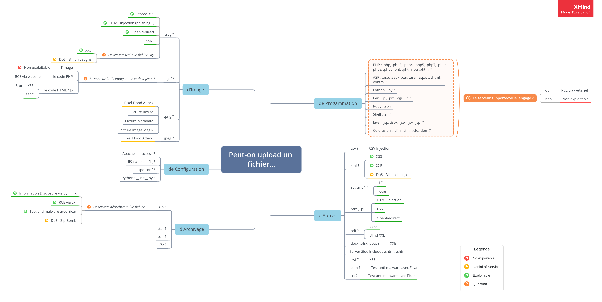

  

# Payloads destinés au téléversement de fichier

De nombreux applications permettent le téléversement/téléchargement de données/informations. Mais l'acceptation de fichiers peut présenter des risques. 

Vous trouvez ici une liste de payload de fichier à téléverser, lors d'une test d'intrusion par exemple, et ainsi démontrer l'existence de la faille (*POC*).

## Mind map

Ce **mind map** résume les attaques possibles selon le type de fichiers autorisées à être téléverser.

## Présentation

Chaque type de fichier possède un dossier, contenant un **README.md** et un ou plusieurs sous-dossier selon le nombre d'attaques possible.

Le README.md présente les différents attaques et payloads. Des scripts peuvent être présentes pour générer le payload.

## Liste de types de fichiers

Voici la liste de types de fichiers qui peuvent être intéressants à téléverser sur une application. La plupart des applications permettant un téléversement de fichiers disposent généralement d'une forme de protection, telle qu'une allowlist / blocklist de fichiers autorisées ou non. Bien que les allowlist soient la méthode la plus sûre pour protéger les téléversements de fichiers, de nombreux applications utilisent les blocklist. Il est donc utile d'essayer les extensions de fichiers les moins utilisées.

### Programmation

| Type       | Extension                                                                                                      | Risque                                                    |
| ---------- | -------------------------------------------------------------------------------------------------------------- | --------------------------------------------------------- |
| PHP        | `.php`, `.php3`, `.php4`, `.php5`, `.php7`, `.phar`, `.phps`, `.phpt`, `.pht`, `.phtm`, `.phtml`               | **RCE** via webshell, **Information Disclosure**          |
| ASP        | `.asp`, `.aspx`, `.cer`, `.asa`, `.aspx`, `.cshtml`, `.vbhtml`                                                 | **RCE** via webshell                                      |
| SSI        | `.shtml`, `.stm`, `.shtm`                                                                                      | **RCE** xap, **Information Disclosure** via SSI Injection |
| Python     | `.py`                                                                                                          | **RCE** via webshell                                      |
| Perl       | `.pl`, `.pm`, `.cgi`, `.lib` (note, `.pm` and `.lib` cannot be called directly, but rather invoked as modules) | **RCE** via webshell                                      |
| Ruby       | `.rb`                                                                                                          | **RCE** via webshell                                      |
| Shell      | `.sh`                                                                                                          | **RCE** via webshell                                      |
| Java       | `.jsp`, `.jspx`, `.jsw`, `.jsv`, `.jspf`                                                                       | **RCE** via webshell                                      |
| Coldfusion | `.cfm`, `.cfml`, `.cfc`, `.dbm` (if IIS is configured right)                                                   | **RCE** via webshell                                      |

### Fichier de Configuration

| Type   | Extension     | Risque                              |
| ------ | ------------- | ----------------------------------- |
| Apache | `.htaccess`   | **RCE**, **Information Disclosure** |
| IIS    | `web.config`  | **RCE** via ASP webshell, **XSS**   |
| Python | `__init__.py` |                                     |

## Archivage

| Type | Extension | Risque                                                                                                  |
| ---- | --------- | ------------------------------------------------------------------------------------------------------- |
| Zip  | `.zip`    | **Information Disclosure** via Symlink, **RCE** via LFI, **Propagation de malware** (Test anti malware) |
| RAR  | `.rar`    |                                                                                                         |
| tar  | `.tar`    |                                                                                                         |
| 7z   | `7z`      |                                                                                                         |

## Image

| Type | Extension       | Risque                                                              |
| ---- | --------------- | ------------------------------------------------------------------- |
| JPEG | `.jpg`, `.jpeg` | **RCE** via ImageTragick                                            |
| PNG  | `.png`          | **RCE** via ImageTragick                                            |
| GIF  | `.gif`          | **RCE** via ImageTragick                                            |
| SVG  | `.svg`          | **XXS**, **XXE**, **HTML Injection**, **Open Redirection**, **DoS** |
| MVG  | `.mvg`          | **RCE** via ImageTragick                                            |

## Langage de balisage

| Type  | Extension       | Risque                                            |
| ----- | --------------- | ------------------------------------------------- |
| HTML  | `.html`, `.htm` | **XSS**, **HTML Injection**, **Open Redirection** |
| XML   | `.xml`          | **XXE**, **XXS**, **DoS**                         |
| XHTML | `.xhtml`        |                                                   |

## Document Office Open XML

| Type                | Extension        | Risque |
| ------------------- | ---------------- | ------ |
| Document Word       | `.docx`, `.docm` |        |
| Document Excel      | `.pptx`, `.pptm` |        |
| Document PowerPoint | `.xlsx`, `.xlsm` |        |

### Autres

| Type  | Extension      | Risque                                         |
| ----- | -------------- | ---------------------------------------------- |
| EICAR | `.com`, `.zip` | **Propagation de malware** (Test anti malware) |
|       |                |                                                |
|       |                |                                                |

## Nom de fichiers

| Nom du fichier       | Explication                                                            |
| -------------------- | ---------------------------------------------------------------------- |
| `../../../index.php` | Sortir du répertoire de téléchargement, et écraser le fichier original |
|                      |                                                                        |
|                      |                                                                        |
|                      |                                                                        |
|                      |                                                                        |

## Todo

Firstly, it uses a path provided by the user. This path is not 
validated, therefore, it would allow the user to upload the file to any 
path on the hosting server.

Secondly, it does not restrict the type of the file being uploaded, 
therefore, it would allow the user to upload a malicious file to gain 
access to the server.

Finally, it does not restrict the size of the file. This would allow 
to easily exhaust the host resources and consequently produce a DoS.

- **Picture Resize** [virtualabs.fr - Bulletproof JPEGs](https://virtualabs.fr/Nasty-bulletproof-Jpegs-l.html), pour PHP avec LFI
- **Picture Metadata**
- Générer des payloads avec metasploit
- `.cert` ?
- Cross-site content hijacking issues can be exploited by uploading a
  file with allowed name and extension but with Flash, PDF, or
  Silverlight contents.
- SSRF
- reverse shell : [Reverse Shell Cheat Sheet | pentestmonkey](http://pentestmonkey.net/cheat-sheet/shells/reverse-shell-cheat-sheet)
- [GitHub - osnr/horrifying-pdf-experiments: Stuff which works in Chrome and maybe Acrobat and Foxit.](https://github.com/osnr/horrifying-pdf-experiments)

## Annexes

- Unrestricted File Upload | OWASP : https://owasp.org/www-community/vulnerabilities/Unrestricted_File_Upload

- Test Upload of Unexpected File Types | WSTG - Latest | OWASP : https://owasp.org/www-project-web-security-testing-guide/latest/4-Web_Application_Security_Testing/10-Business_Logic_Testing/08-Test_Upload_of_Unexpected_File_Types.html

- Test Upload of Malicious Files | WSTG - Latest | OWASP : https://owasp.org/www-project-web-security-testing-guide/latest/4-Web_Application_Security_Testing/10-Business_Logic_Testing/09-Test_Upload_of_Malicious_Files.html

- PayloadsAllTheThings: A list of useful payloads and bypass for Web Application Security and Pentest/CTF : https://github.com/swisskyrepo/PayloadsAllTheThings

- https://book.hacktricks.xyz/pentesting-web/file-upload

- [File Upload XSS - Brute XSS](https://brutelogic.com.br/blog/file-upload-xss/)

- [fuzzdb/attack/file-upload at master · fuzzdb-project/fuzzdb · GitHub](https://github.com/fuzzdb-project/fuzzdb/tree/master/attack/file-upload)

- [SecLists/Web-Shells at master · danielmiessler/SecLists · GitHub](https://github.com/danielmiessler/SecLists/tree/master/Web-Shells)

- [SecLists/Payloads at master · danielmiessler/SecLists · GitHub](https://github.com/danielmiessler/SecLists/tree/master/Payloads)

- [GitHub - modzero/mod0BurpUploadScanner: HTTP file upload scanner for Burp Proxy](https://github.com/modzero/mod0BurpUploadScanner)

- [GitHub - almandin/fuxploider: File upload vulnerability scanner and exploitation tool.](https://github.com/almandin/fuxploider)

- [GitHub - wireghoul/htshells: Self contained htaccess shells and attacks](https://github.com/wireghoul/htshells)

Définition du problème de téléversement de fichiers : 

- https://cwe.mitre.org/data/definitions/434.html

- [Protection from Unrestricted File Upload Vulnerability | Qualys Security Blog](https://blog.qualys.com/securitylabs/2015/10/22/unrestricted-file-upload-vulnerability)
